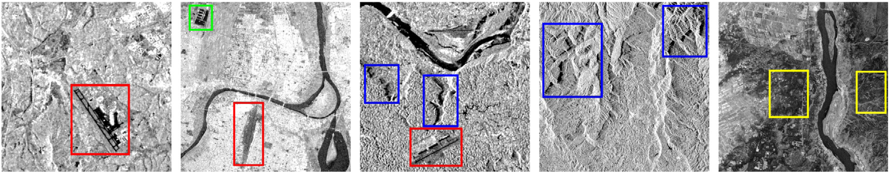
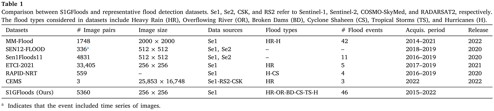
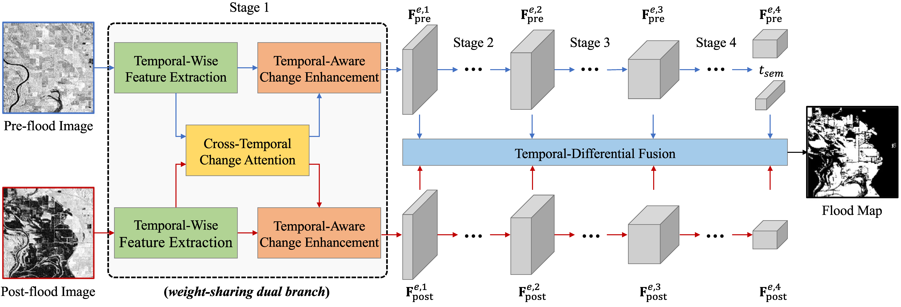

<div align="center">
<h1 align="center">☀️S1GFloods Benchmark☀️</h1>

<h3 align="center">DAM-Net: Flood detection from SAR imagery using differential attention metric-based vision transformers</h3>


[Tamer Saleh](https://scholar.google.com/citations?user=KAmm5ZkAAAAJ&hl=en)<sup>1,2</sup>, 
[Xingxing Weng]()<sup>1</sup>, 
[Shimaa Holail](https://scholar.google.com/citations?user=WKKVqDgAAAAJ&hl=en)<sup>1</sup>, 
[Chen Hao]()<sup>1</sup>, 
[Gui Song-Xia](https://scholar.google.com/citations?user=SAUCVsEAAAAJ&hl=en)<sup>1</sup>


<sup>1</sup> Wuhan University, <sup>2</sup> Benha University

[](https://www.sciencedirect.com/science/article/abs/pii/S0924271624002168)  [](https://drive.google.com/file/d/1bm_sFfJ05Fryj6Ib1niIidOywljzIEgo/view?usp=sharing)   [](https://huggingface.co/datasets/Tamer-Saleh/S1GFloods)  [](https://pan.baidu.com/s/1E4dEJtlQ6xeUDRPGO904KQ?pwd=m6gr)

</div>


## 🛎️Updates 
 <p align="center">
  
</p>

* **`🎉 February 2026 Achievement`**: S1GFloods has been selected as an 🔥 ESI Hot Paper and Highly Cited Paper, placing it among the top 1% of publications in the Geosciences field 🏆🌍
* **` 13 May 2024`**: DAM-Net has been accepted by [ISPRS JP&RS and online available](https://www.sciencedirect.com/science/article/abs/pii/S0924271624002168) now!!
* **` 02 July 2023`**: The S1GFloods benchmark related to our paper has now released. You are warmly welcome to use it!!
* **` 25 June 2023`**: DAM-Net has been submitted for publication at ISPRS Journal of Photogrammetry and Remote Sensing!!
* **` 01 Jun 2023`**: The [arXiv paper](https://arxiv.org/abs/2306.00704v1) of DAM-Net is now online.


## 🔭Dataset Overview

* [**S1GFloods**](https://www.sciencedirect.com/science/article/abs/pii/S0924271624002168) is the first open-access, globally distributed, event-diverse Sentinel-1 SAR dataset specifically designed to support AI-based flood response applications. The dataset comprises **5,360** image pairs with a spatial size of **256 × 256** pixels, covering **46** major flood events that occurred between **2015** and **2022** across **six** continents, with particular emphasis on developing countries. Its broad geographic and event diversity provides a comprehensive benchmark for developing and evaluating robust flood-mapping models.

* The accompanying animation illustrates pre- and post-event SAR imagery along with sample flood-mapping results for a rural region in Iran affected by severe flooding in **March 2019**. The figure on the right presents a magnified visualization of a **1 km × 1 km** area (highlighted by the yellow box in the larger scene), demonstrating the extent of flood impacts on buildings as identified by our model.

* **Dataset Statistics**

- **Training Set**: 4,300 image pairs  
- **Validation Set**: 530 image pairs  
- **Testing Set**: 530 image pairs 
- **Image Size**: 256 × 256 pixels
- **Spatial Resolution**: 10 meters  

* **Each image pair includes:**
- A manually annotated binary label map
- Pixel value `0`: Background / non-flooded area
- Pixel value `255`: Newly inundated flood area


 <p align="center">
  
  
</p>

 
 

 <div align="center">
  
  
  
  
</div>

 <div align="center">
  
  
  
  
</div>

 <div align="center">
  
  
  
  
</div>

 <div align="center">
  
  
  
  
</div>


## Requirements

[](https://www.python.org/downloads/release/python-376/) 
[](https://pytorch.org/get-started/previous-versions/)
[](https://pypi.org/project/torchvision/0.8.2/)
[](https://opencv.org/opencv-4-5-5/)
[](https://developer.nvidia.com/cuda-10.1-download-archive-base)
[](https://senbox.atlassian.net/wiki/spaces/SNAP/pages/50855941/Configure+Python+to+use+the+SNAP-Python+snappy+interface)
[](https://pypi.org/project/wandb/)

### Reproducible environment with uv

The checked-in uv environment targets Linux, Python 3.10, and NVIDIA CUDA 12.4. PyTorch wheels are resolved from the Aliyun mirror; all other packages use the TUNA PyPI mirror.

```shell
uv sync --locked
```

Verify the CUDA environment:

```shell
uv run python -c "import torch; print(torch.__version__, torch.cuda.is_available(), torch.cuda.get_device_name(0))"
```

The repository does not include the optional `PRETRAINED/` backbone weights. When they are absent, the model starts with random initialization.


## Our model
An overview of the proposed DAM-Net. The feature maps of the pre-and post-event image pairs are extracted through a Siamese structure and pre-trained remote sensing. 



### 🔭 Baselines <a name="baselines"></a>

- :open_book:	:open_book:	 :open_book: DTCDSCN [[here](https://ieeexplore.ieee.org/abstract/document/9311793)]
- :open_book:	:open_book:	 :open_book: UNet [[here](https://www.int-arch-photogramm-remote-sens-spatial-inf-sci.net/XLIV-4-W3-2020/215/2020/)]
- :open_book:	:open_book:	 :open_book: FC-Siam [[here](https://ieeexplore.ieee.org/abstract/document/8451652)]
- :open_book:	:open_book:	 :open_book: SNUNet–ECAM [[here](https://ieeexplore.ieee.org/abstract/document/9355573)]
- :open_book:	:open_book:	 :open_book: Siam-Nested-UNet [[here](https://dl.acm.org/doi/abs/10.1145/3437802.3437810)]
- :open_book:	:open_book:	 :open_book: ResNet50-IMP [[here](https://openaccess.thecvf.com/content_cvpr_2016/papers/He_Deep_Residual_Learning_CVPR_2016_paper.pdf)]
- :open_book:	:open_book:	 :open_book: ResNet50-RSP [[here](https://ieeexplore.ieee.org/abstract/document/9782149)]
- :open_book:	:open_book:	 :open_book: Swin–T-RSP [[here](https://ieeexplore.ieee.org/abstract/document/9782149)]
- :open_book:	:open_book:	 :open_book: Swin-T-IMP [[here](https://ieeexplore.ieee.org/abstract/document/9736956)]
- :open_book:	:open_book:	 :open_book: ViTAEv2 [[here](https://arxiv.org/pdf/2202.10108.pdf)]


## 📒 Dataset Preparation

  Prepare the following folders to organize this repo:

     For the S1GFloods dataset, clip the images to 256 × 256 patches. Please, respect the following structure: 
              ├── SIGFloods
              │   ├── train
              │   │   ├── A                           Images of Time 1 before the flood event
              │   │   │   └── <region><year><XY>.png
              │   │   ├── B                           Images of Time 2 after the flood event
              │   │   │   └── <region><year><XY>.png
              │   │   └── GT                          Ground truth labels
              │   │       └── <region><year><XY>.png
              │   ├── val 
              │   │   ├── A                           
              │   │   │   └── <region><year><XY>.png
              │   │   ├── B                           
              │   │   │   └── <region><year><XY>.png
              │   │   └── GT                          
              │   │       └── <region><year><XY>.png
              │   ├── test
              │   │   ├── A                           
              │   │   │   └── <region><year><XY>.png
              │   │   ├── B                           
              │   │   │   └── <region><year><XY>.png
              │   │   └── GT                          
              │   │       └── <region><year><XY>.png
              │  

              
## :truck: Datasets <a name="dataset"></a>

You can download our novel public S1GFloods dataset through the following link:

- [x] [S1GFloods][baidu drive](https://pan.baidu.com/s/1E4dEJtlQ6xeUDRPGO904KQ?pwd=m6gr)
- [x] [S1GFloods][Google Drive Link](https://drive.google.com/file/d/1bm_sFfJ05Fryj6Ib1niIidOywljzIEgo/view?usp=sharing)
- [x] [S1GFloods][HuggingFace Link](https://huggingface.co/datasets/Tamer-Saleh/S1GFloods)


## 📚 Use example

- Training

  ```shell
  bash train_s1gfloods.sh /path/to/S1GFloods
  ```

  The dataset directory can also be passed directly to the Python entry point:

  ```shell
  uv run python train.py --dataset-dir /path/to/S1GFloods
  ```

- Testing

  ```shell
  uv run python eval.py --path .tmp/S1GFloods_vitae_rsp/checkpoint_epoch_<N>.pth
  ```
  
## Results

<p align="center">

</P>


## Visualization

<p align="center">

</P>


### :page_with_curl: Citing <a name="citing"></a>

```bibtex
@article{saleh2024dam,
  title={DAM-Net: Flood detection from SAR imagery using differential attention metric-based vision transformers},
  author={Saleh, Tamer and Weng, Xingxing and Holail, Shimaa and Hao, Chen and Xia, Gui-Song},
  journal={ISPRS Journal of Photogrammetry and Remote Sensing},
  volume={212},
  pages={440--453},
  year={2024},
  publisher={Elsevier}
}
```

  
## Contact Information

If you have any questions or would like to collaborate, please reach out to me at tamersaleh@whu.edu.cn.

## License
The datasets are released for non-commercial and research purposes only. For commercial purposes, please contact the authors.


## Acknowledgment

Appreciate the work from the following repositories:

- [wenhwu/awesome-remote-sensing-change-detection](https://github.com/wenhwu/awesome-remote-sensing-change-detection)
- [SNUNet-CD](https://github.com/RSCD-Lab/Siam-NestedUNet)
- [BIT-CD](https://github.com/justchenhao/BIT_CD)

## Related resources
- [ASF-Dataset](https://search.asf.alaska.edu/)
- [Sentinel-Hub](https://scihub.copernicus.eu/)
- [SNAP Toolbox](http://step.esa.int/main/download/)

## Star History

[](https://star-history.com/#Tamer-Saleh/S1GFlood-Detection&Date)
